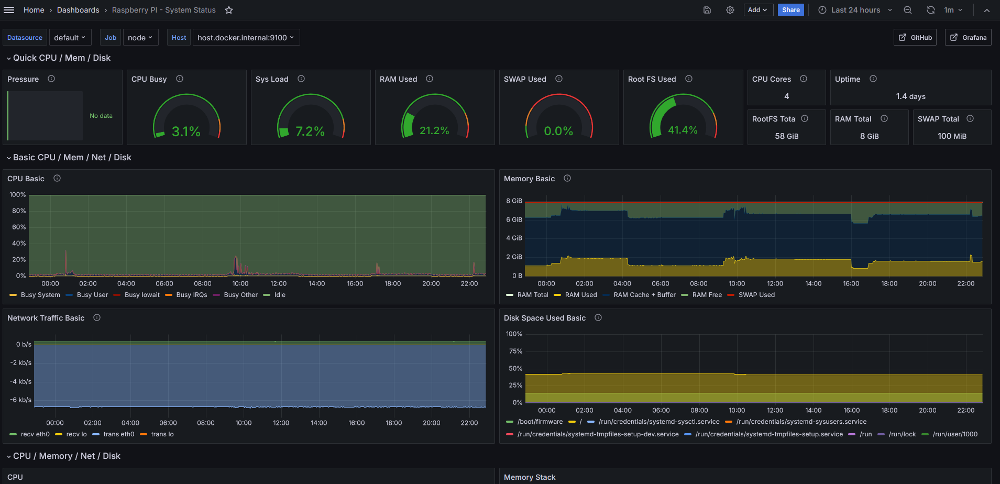

## Grafana + Prometheus Node for Raspberry

A completed docker compose to run a Grafana + Prometheus in Raspberry Pi 5. 

You can see the following video from youtube about this specification:

https://www.youtube.com/watch?v=JR8psgpRtIg

Original Git Repo (from Video):
https://github.com/storyofdavid/tutorials-and-demos/tree/main/youtube/023-grafana-pometheus-node-docker

Grafana Dashboard URL:
https://grafana.com/grafana/dashboards/1860-node-exporter-full/

## Example of Grafana running in Raspeberry PI

